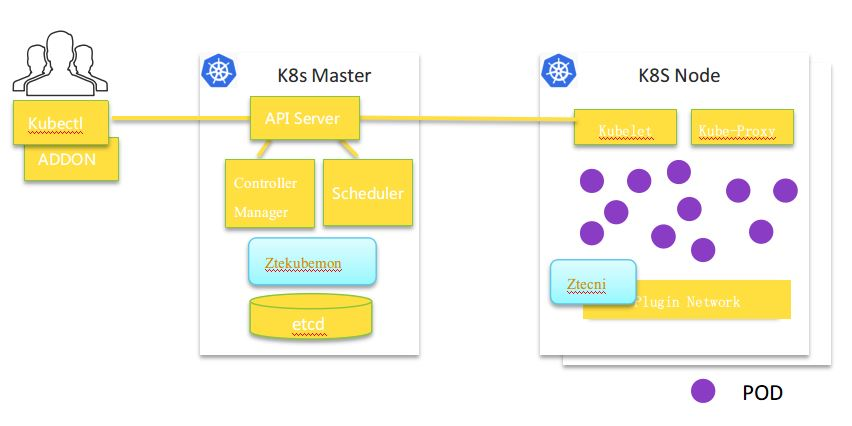

# ZTECNI

Introduce ZTE CNI related

----------

## 1. Solution ##

The need for cloud-based multi-tenant deployment, automatic network management and control, and visual O&M drives the development of the SDN technology, accomplishing the complete automatic orchestration and immediate effectiveness of the computing resources, storage capabilities, and networking capabilities at the IaaS layer. SDN networks within DCs are deployed through the overlay technology, which decouples software from hardware, supports multi-vendor deployment, and puts the focus of SDN on the support for cloud network virtualization rather than the fault convergence based on the network topology.
In order to continue the SDN-based management of VMs and containers on networks, and allow users to retain the virtualized deployment habits while enjoying lightweight isolation of container resources at the same network level, with unified SDN control policies, the IaaS\PaaS co-existence architecture will be implemented in the actual practice. In this manner, resource clusters and cluster networks in different domains and areas can interoperate under unified SDN scheduling, and fully leverage the SDN benefits based on O&M and control policies.

## 2. ZENIC SDN working principle: ##

The ZENIC SDN provides a ZENIC plugin at the OpenStack Neutron for decoupling. The plug-in translates and sends the network services delivered by the Neutron to the SDN controller, which then delivers policies to vSwitches, switches, and other devices.
On the container side, the ZENIC SDN provides the Ztekubemon plug-in on the OpenShift and K8S masters for listening to the K8S API server and responding to and translating the requests from the CNI to the SDN controller. The controller then assigns IP addresses to the container pods to ensure that the same-tenant and same-subnet IP addresses are provisioned. On the K8S node, the network-driven CNI plug-in Ztecni is developed to replace the default CNI plug-in of OpenShift, abides by the CNI 2.0 protocol, binds the ports of container instances to vSwitches, and binds the IP addresses to the container network adapters. The plug-in is now able to interwork with OVSs and ZTE-developed DVSs to complete the orchestration of vHost, SR-IOV, DPDK, and multi-port ports.

The following figure illustrates the framework:

## 3. Technical Features 

* The Ztekubemon program needs to be configured with the ZENIC SDN controller address, and corresponding authentication information and certificates to communicate with the controller properly.

* The Ztecni plug-in supports an ansible deployment method that allows daemonSet-based integration in accordance with OpenShift platform requirements.

* The ZENIC SDN controller provides centralized orchestration of SDN networks for container networking environments, simplifies IT O&M, and extends OpenShift networking capabilities. With the Ztekubemon and Ztecni plug-ins, the ZENIC SDN controller supports OpenShift's namespace management, network management, pod lifecycle management, network policy management, extended network VRF management, network policy management, and pod QoS rate-limiting features.

* ZTE's ZENIC SDN solution enables a multi-tenant approach, matches the Kubernetes namespace model, and provides both application-based and image-based deployment methods.

* The ZENIC SDN solution supports not only a separate container cloud architecture, but also the interworking between container clouds and OpenStack clouds. It also supports IaaS and PaaS coexistence, and works with OpenShift to provide unified multi-tenant network resource management and interworking policy management.

* The ZENIC SDN solution inherits the IaaS layer multi-tenancy, hardware and software gateways, and distributed/centralized routing. It supports automatic overlay network deployment under the OpenShift platform and provides flexible QoS capabilities and security policies.

* With the multi-VPC interworking, single-DC multi-GW feature, multi-DC cross-firewall interworking, and other IaaS capabilities of the ZTE ZENIC SDN solution, the OpenShift platform provides north-south straight-through or NAT forwarding, east-west cross-namespace interworking, cross-cluster interworking, and IPv4/IPv6 dual-stack containers.
